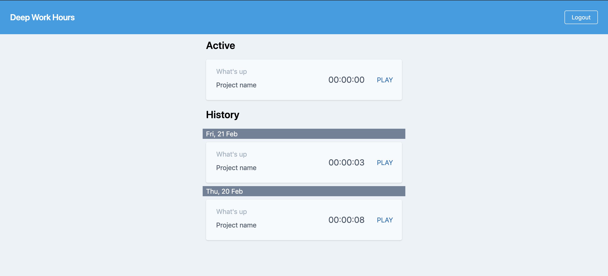

# Deep Work Hours

Deep Work Hours is a time tracking software built with 
[Elixir](https://elixir-lang.org/), [Phoenix](https://www.phoenixframework.org/), 
and [Tailwind CSS](https://tailwindcss.com/)

## Background

In Oct 2019, I started a new job as a tech lead, and switched from PHP to Elixir. 
With the intention to master the tech stack my team is using, 
I rebuild my side project [Deep Work Hours](https://deepworkhours.com/) with the same tech stack.

## Install

  * Install dependencies with `mix deps.get`
  * Create and migrate your database with `mix ecto.setup`
  * Copy sample secret file `config/dev.secret.exs.sample` to `config/dev.secret.exs`
  * Configure external services in secret file `config/dev.secret.exs`
  * Install Node.js dependencies with `cd assets && npm install`
  * Start Phoenix endpoint with `mix phx.server`

## External Service

### Auth0

[Auth0](https://auth0.com/) handles the user authentication.

[Tutorial](https://auth0.com/blog/elixir-and-phoenix-tutorial-build-an-authenticated-app/)

## License

None